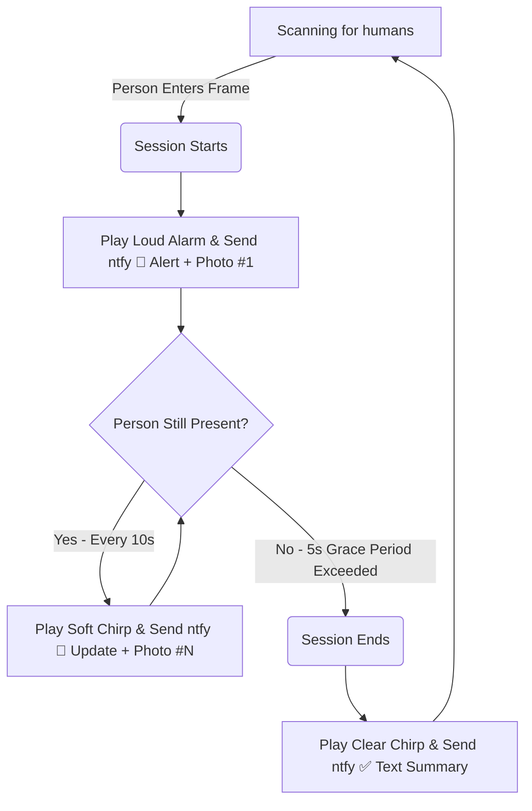

# 🔒 FaceGuard — Session-Based Person Detection Security System

AI-powered home security that detects humans from any angle/distance, starts an intrusion session, captures snapshots at regular intervals, and delivers continuous photo alerts to your phone.

**Zero API keys required.** Runs 100% in-browser using WebAssembly.

---

## Key Features

- 📹 **Intelligent Person Detection** — Uses MediaPipe Object Detector to detect humans from front, side, or back views at any distance.
- ⏱️ **Session-Based Monitoring** — Triggers a security session on entry, captures updates every 10 seconds while the person remains, and sends a summary report when they exit.
- 📱 **Cross-Platform Mobile Alerts** — Delivers real-time notifications with attachments to the **ntfy app** on both iOS and Android (completely free, no account needed).
- 🔑 **Deterministic ID Generation** — Generates your unique, private notification channel from your Name + PIN. Recreate the same channel on any device.
- 💾 **High-Capacity IndexedDB Storage** — Stores raw binary snapshot blobs directly in your browser's database. No storage limits or base64 overhead.
- 🔊 **Audio Alarm Synthesis** — Plays distinct warning beeps (intrusion start, photo updates, session clear) using the browser's Web Audio API.
- 🎨 **Premium CCTV Dark Aesthetic** — Monospaced status dashboard, glowing overlay corners, live indicators, and screen-flash warning effects.
- 🚀 **Automated CI/CD Deploys** — Equipped with GitHub Actions to build and deploy to GitHub Pages automatically on push.

---

## Tech Stack

| Component | Technology |
| :--- | :--- |
| **Object Detection** | MediaPipe Tasks Vision (EfficientDet Lite0 WASM) |
| **Camera Feed** | HTML5 `getUserMedia` API |
| **Local Database** | Browser IndexedDB Store (`FaceGuardDB`) |
| **Push Gateway** | `ntfy.sh` API Relay (Safe PUT attachments) |
| **Audio Alarm** | Web Audio API (Square & Sine wave synthesizers) |
| **PWA Support** | Service Worker + Web App Manifest (`manifest.json`) |
| **Bundler / Server** | Vite 5 + ES Modules |
| **Deployment** | GitHub Actions Workflow |

---

## Getting Started

### 1. Run Locally
Clone the repository and start the development server:
```powershell
npm install
npm run dev
```
Open **http://localhost:5173** in your browser.

### 2. Set Up Your Security ID
1. On first launch, the glowing Welcome Modal will ask for your **Name**, **Location** (e.g. `Front Door`), and a **PIN**.
2. FaceGuard cryptographically hashes these locally (`SHA-256`) to derive a private, deterministic channel ID (e.g. `fg-3a7b9c2d1e4f`).
3. Tap **Activate FaceGuard** to save your profile. The same Name + PIN combination will always recreate the exact same channel ID on any device.

### 3. Subscribe on Your Phone
1. Install the **ntfy** app on your phone:
   - [App Store (iOS)](https://apps.apple.com/us/app/ntfy/id1625396347)
   - [Play Store (Android)](https://play.google.com/store/apps/details?id=io.heckel.ntfy)
2. Open the ntfy app, tap **+** (Subscribe to topic), enter your generated channel ID (e.g. `fg-3a7b9c2d1e4f`), and subscribe.
3. Tap **Test Notification** in FaceGuard to verify the connection.

---

## How It Works

### Intrusion Session Lifecycle


### Proximity & Sensitivity
FaceGuard maps the person's bounding box area relative to the camera frame to classify proximity:
*   `ratio > 0.45` → `very-close` (< 1.5 ft)
*   `ratio > 0.25` → `close` (1.5 - 3 ft)
*   `ratio > 0.12` → `medium` (3 - 6 ft)
*   `ratio <= 0.12` → `far` (> 6 ft)

Adjusting the **Sensitivity** slider sets the trigger range for starting a session:
*   **Low (1)**: Only triggers if the person is `close` or `very-close`.
*   **Medium (2)**: Triggers when the person is `medium`, `close`, or `very-close` (Default).
*   **High (3)**: Triggers on any detection (`far` onwards).

---

## Project Structure

```
face-guard/
├── .github/workflows/
│   └── deploy.yml              # GitHub Actions deploy script
├── public/
│   └── icons/                  # PWA icons
├── src/
│   ├── modules/
│   │   ├── AlertManager.js     # Session state machine & snapshots
│   │   ├── AudioManager.js     # Sound effects synthesizer
│   │   ├── CameraManager.js    # Stream lifecycle management
│   │   ├── CanvasOverlay.js    # CCTV bounding box rendering
│   │   ├── IdentityManager.js  # Deterministic SHA-256 topic generation
│   │   ├── Notifier.js         # ntfy.sh & browser alerts
│   │   ├── PersonDetector.js   # MediaPipe Object Detector
│   │   └── StorageManager.js   # IndexedDB database management
│   ├── App.js                  # Main app orchestrator
│   ├── config.js               # Central config parameters
│   ├── main.js                 # App bootstrapper
│   └── style.css               # CCTV theme stylesheets
├── index.html                  # HTML Shell
├── manifest.json               # PWA config
├── service-worker.js           # Offline service worker
└── vite.config.js              # Vite config with base path
```
